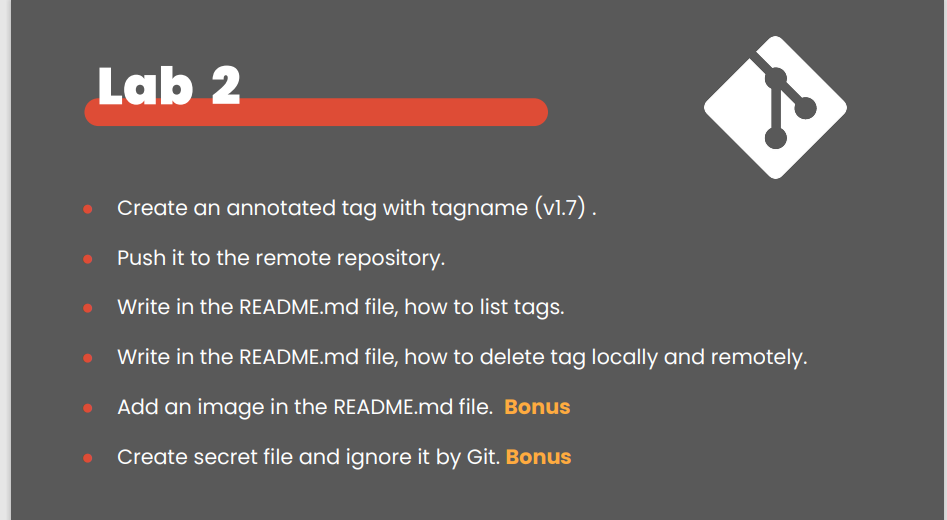

#How to Remove Branches Locally and Remotely

#Remove Branch Locally we use this commmand :$ git branch -d div

#Delete the dev branch on the remote repository : $git push origin --delete dev

To list tags in a Git repository we use this command :$git tag -l 

To delete a tag locally :$git tag -d <tagname>

To delete a tag on the remote repository:$git push --delete origin <tagname>

